

  
ENSO Analysis

| <b>ENSO Index</b>   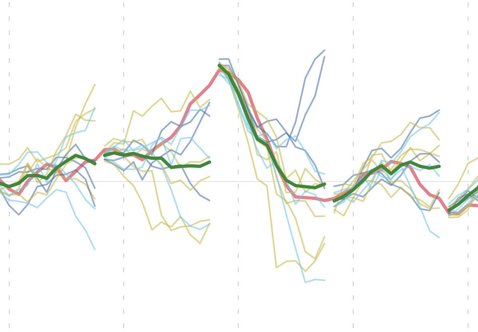 | <b>ENSO RMSE</b>   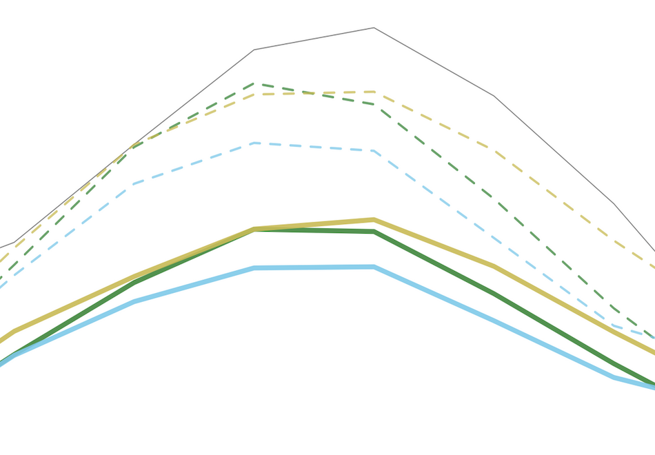 |
| :--- | :--- |
| 

Choose experiment
  &emsp;&emsp;&nbsp;  &emsp;&ensp;&nbsp;    [ens_means](https://github.com/ufs-community/ufs-analysis/blob/main/notebooks/sfs/enso/default/enso-index-ens_means.ipynb) &emsp;&nbsp;&ensp; [ens_means](https://mybinder.org/v2/gh/ufs-community/ufs-analysis/main?urlpath=lab/tree/notebooks/sfs/enso/default/enso-index-ens_means.ipynb) &emsp;&ensp;&nbsp; [ens_means](https://colab.research.google.com/github/ufs-community/ufs-analysis/blob/main/notebooks/sfs/enso/colab/enso-index-ens_means.ipynb)   [baseline](https://github.com/ufs-community/ufs-analysis/blob/main/notebooks/sfs/enso/default/enso-index-baseline.ipynb) &emsp;&emsp;&emsp;&nbsp; [baseline](https://mybinder.org/v2/gh/ufs-community/ufs-analysis/main?urlpath=lab/tree/notebooks/sfs/enso/default/enso-index-baseline.ipynb) &emsp;&emsp;&emsp;&nbsp; [baseline](https://colab.research.google.com/github/ufs-community/ufs-analysis/blob/main/notebooks/sfs/enso/colab/enso-index-baseline.ipynb)   [beta.0.1](https://github.com/ufs-community/ufs-analysis/blob/main/notebooks/sfs/enso/default/enso-index-beta.0.1.ipynb) &emsp;&emsp;&emsp;&ensp; [beta.0.1](https://mybinder.org/v2/gh/ufs-community/ufs-analysis/main?urlpath=lab/tree/notebooks/sfs/enso/default/enso-index-beta.0.1.ipynb) &emsp;&emsp;&emsp;&ensp; [beta.0.1](https://colab.research.google.com/github/ufs-community/ufs-analysis/blob/main/notebooks/sfs/enso/colab/enso-index-beta.0.1.ipynb)   [c96_beta.0.1](https://github.com/ufs-community/ufs-analysis/blob/main/notebooks/sfs/enso/default/enso-index-c96_beta.0.1.ipynb) &nbsp;&nbsp;&nbsp;&nbsp; [c96_beta.0.1](https://mybinder.org/v2/gh/ufs-community/ufs-analysis/main?urlpath=lab/tree/notebooks/sfs/enso/default/enso-index-c96_beta.0.1.ipynb) &ensp;&ensp;&nbsp; [c96_beta.0.1](https://colab.research.google.com/github/ufs-community/ufs-analysis/blob/main/notebooks/sfs/enso/colab/enso-index-c96_beta.0.1.ipynb)   [cpc_ics](https://github.com/ufs-community/ufs-analysis/blob/main/notebooks/sfs/enso/default/enso-index-cpc_ics.ipynb) &emsp;&emsp;&emsp;&ensp; [cpc_ics](https://mybinder.org/v2/gh/ufs-community/ufs-analysis/main?urlpath=lab/tree/notebooks/sfs/enso/default/enso-index-cpc_ics.ipynb) &emsp;&emsp;&emsp;&ensp; [cpc_ics](https://colab.research.google.com/github/ufs-community/ufs-analysis/blob/main/notebooks/sfs/enso/colab/enso-index-cpc_ics.ipynb) 
   | 

Choose platform
  &emsp;&emsp;&nbsp;  &emsp;&ensp;&nbsp;  
   |
| <b>ENSO ACC Heatmap beta1 </b>   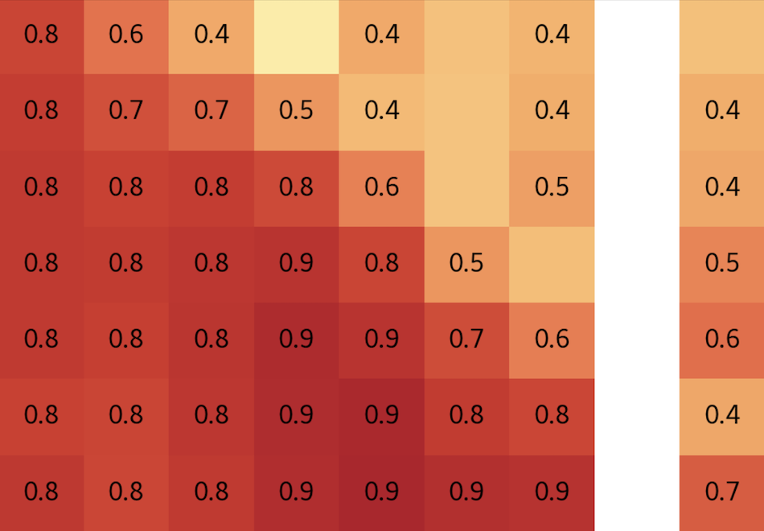 | <b>ENSO Teleconnections Precip</b>   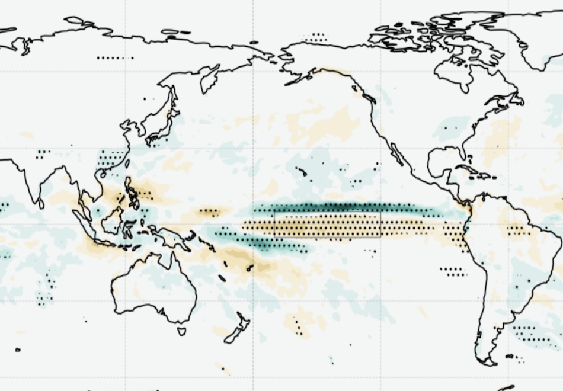  |
| 

Choose platform
  &emsp;&emsp;&nbsp;  &emsp;&ensp;&nbsp;  
   | 

Choose experiment
  &emsp;&emsp;&nbsp;  &emsp;&ensp;&nbsp;    [UFSvsUFS](https://github.com/ufs-community/ufs-analysis/blob/main/notebooks/sfs/enso/default/enso-teleconnections-precip-UFSvsUFS.ipynb) &emsp;&ensp;&ensp; [UFSvsUFS](https://mybinder.org/v2/gh/ufs-community/ufs-analysis/main?urlpath=lab/tree/notebooks/sfs/enso/default/enso-teleconnections-precip-UFSvsUFS.ipynb) &emsp;&emsp;&nbsp; [UFSvsUFS](https://colab.research.google.com/github/ufs-community/ufs-analysis/blob/main/notebooks/sfs/enso/colab/enso-teleconnections-precip-UFSvsUFS.ipynb)   [baseline](https://github.com/ufs-community/ufs-analysis/blob/main/notebooks/sfs/enso/default/enso-teleconnections-precip-baseline.ipynb) &emsp;&emsp;&emsp;&nbsp; baseline &emsp;&emsp;&emsp;&nbsp; [baseline](https://colab.research.google.com/github/ufs-community/ufs-analysis/blob/main/notebooks/sfs/enso/colab/enso-teleconnections-precip-baseline.ipynb)   [beta.0.1](https://github.com/ufs-community/ufs-analysis/blob/main/notebooks/sfs/enso/default/enso-teleconnections-precip-beta.0.1.ipynb) &emsp;&emsp;&emsp;&ensp; beta.0.1 &emsp;&emsp;&emsp;&ensp; [beta.0.1](https://colab.research.google.com/github/ufs-community/ufs-analysis/blob/main/notebooks/sfs/enso/colab/enso-teleconnections-precip-beta.0.1.ipynb)   [c96_beta.0.1](https://github.com/ufs-community/ufs-analysis/blob/main/notebooks/sfs/enso/default/enso-teleconnections-precip-c96_beta.0.1.ipynb) &nbsp;&nbsp;&nbsp;&nbsp; c96_beta.0.1 &ensp;&ensp;&nbsp; [c96_beta.0.1](https://colab.research.google.com/github/ufs-community/ufs-analysis/blob/main/notebooks/sfs/enso/colab/enso-teleconnections-precip-c96_beta.0.1.ipynb)   [cpc_ics](https://github.com/ufs-community/ufs-analysis/blob/main/notebooks/sfs/enso/default/enso-teleconnections-precip-cpc_ics.ipynb) &emsp;&emsp;&emsp;&ensp; cpc_ics &emsp;&emsp;&emsp;&ensp; [cpc_ics](https://colab.research.google.com/github/ufs-community/ufs-analysis/blob/main/notebooks/sfs/enso/colab/enso-teleconnections-precip-cpc_ics.ipynb) 
   |
| <b>ENSO Teleconnections Wind</b>   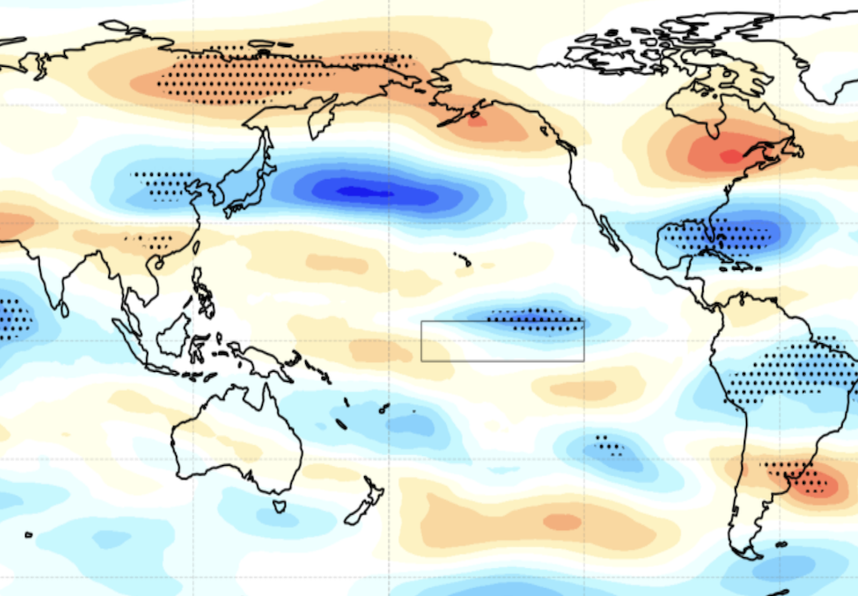 | <b>ENSO Teleconnections Beta*, Ks, RWS</b>    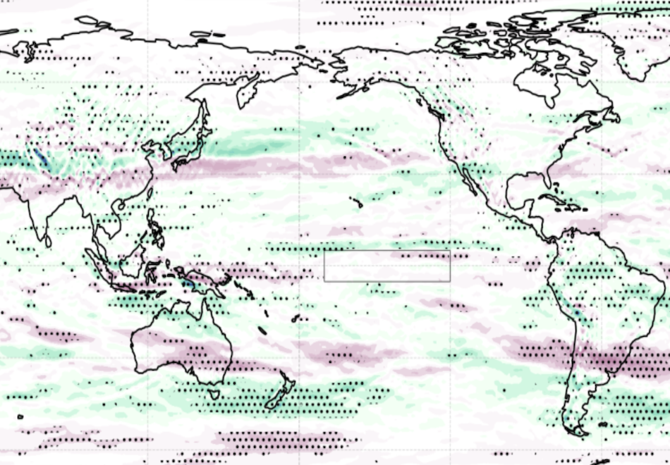 |
| 

Choose experiment
  &emsp;&emsp;&nbsp;  &emsp;&ensp;&nbsp;    [UFSvsUFS](https://github.com/ufs-community/ufs-analysis/blob/main/notebooks/sfs/enso/default/enso-teleconnections-wind-UFSvsUFS.ipynb) &emsp;&ensp;&ensp; UFSvsUFS &emsp;&emsp;&nbsp; [UFSvsUFS](https://colab.research.google.com/github/ufs-community/ufs-analysis/blob/main/notebooks/sfs/enso/colab/enso-teleconnections-wind-UFSvsUFS.ipynb)   [baseline](https://github.com/ufs-community/ufs-analysis/blob/main/notebooks/sfs/enso/default/enso-teleconnections-wind-baseline.ipynb) &emsp;&emsp;&emsp;&nbsp; baseline &emsp;&emsp;&emsp;&nbsp; [baseline](https://colab.research.google.com/github/ufs-community/ufs-analysis/blob/main/notebooks/sfs/enso/colab/enso-teleconnections-wind-baseline.ipynb)   [beta.0.1](https://github.com/ufs-community/ufs-analysis/blob/main/notebooks/sfs/enso/default/enso-teleconnections-wind-beta.0.1.ipynb) &emsp;&emsp;&emsp;&ensp; beta.0.1 &emsp;&emsp;&emsp;&ensp; [beta.0.1](https://colab.research.google.com/github/ufs-community/ufs-analysis/blob/main/notebooks/sfs/enso/colab/enso-teleconnections-wind-beta.0.1.ipynb)   [c96_beta.0.1](https://github.com/ufs-community/ufs-analysis/blob/main/notebooks/sfs/enso/default/enso-teleconnections-wind-c96_beta.0.1.ipynb) &nbsp;&nbsp;&nbsp;&nbsp; c96_beta.0.1 &ensp;&ensp;&nbsp; [c96_beta.0.1](https://colab.research.google.com/github/ufs-community/ufs-analysis/blob/main/notebooks/sfs/enso/colab/enso-teleconnections-wind-c96_beta.0.1.ipynb)   [cpc_ics](https://github.com/ufs-community/ufs-analysis/blob/main/notebooks/sfs/enso/default/enso-teleconnections-wind-cpc_ics.ipynb) &emsp;&emsp;&emsp;&ensp; cpc_ics &emsp;&emsp;&emsp;&ensp; [cpc_ics](https://colab.research.google.com/github/ufs-community/ufs-analysis/blob/main/notebooks/sfs/enso/colab/enso-teleconnections-wind-cpc_ics.ipynb) 
   | 

Choose experiment
  &emsp;&emsp;&nbsp;  &emsp;&ensp;&nbsp;    [UFSvsUFS](https://github.com/ufs-community/ufs-analysis/blob/main/notebooks/sfs/enso/default/enso-teleconnections-rws-UFSvsUFS.ipynb) &emsp;&ensp;&ensp; UFSvsUFS &emsp;&emsp;&nbsp; [UFSvsUFS](https://colab.research.google.com/github/ufs-community/ufs-analysis/blob/main/notebooks/sfs/enso/colab/enso-teleconnections-rws-UFSvsUFS.ipynb)   [baseline](https://github.com/ufs-community/ufs-analysis/blob/main/notebooks/sfs/enso/default/enso-teleconnections-rws-baseline.ipynb) &emsp;&emsp;&emsp;&nbsp; baseline &emsp;&emsp;&emsp;&nbsp; [baseline](https://colab.research.google.com/github/ufs-community/ufs-analysis/blob/main/notebooks/sfs/enso/colab/enso-teleconnections-rws-baseline.ipynb)   [beta.0.1](https://github.com/ufs-community/ufs-analysis/blob/main/notebooks/sfs/enso/default/enso-teleconnections-rws-beta.0.1.ipynb) &emsp;&emsp;&emsp;&ensp; beta.0.1 &emsp;&emsp;&emsp;&ensp; [beta.0.1](https://colab.research.google.com/github/ufs-community/ufs-analysis/blob/main/notebooks/sfs/enso/colab/enso-teleconnections-rws-beta.0.1.ipynb)   [c96_beta.0.1](https://github.com/ufs-community/ufs-analysis/blob/main/notebooks/sfs/enso/default/enso-teleconnections-rws-c96_beta.0.1.ipynb) &nbsp;&nbsp;&nbsp;&nbsp; c96_beta.0.1 &ensp;&ensp;&nbsp; [c96_beta.0.1](https://colab.research.google.com/github/ufs-community/ufs-analysis/blob/main/notebooks/sfs/enso/colab/enso-teleconnections-rws-c96_beta.0.1.ipynb)   [cpc_ics](https://github.com/ufs-community/ufs-analysis/blob/main/notebooks/sfs/enso/default/enso-teleconnections-rws-cpc_ics.ipynb) &emsp;&emsp;&emsp;&ensp; cpc_ics &emsp;&emsp;&emsp;&ensp; [cpc_ics](https://colab.research.google.com/github/ufs-community/ufs-analysis/blob/main/notebooks/sfs/enso/colab/enso-teleconnections-rws-cpc_ics.ipynb) 
   |

  
NAO Analysis

| <b>NAO Index</b>   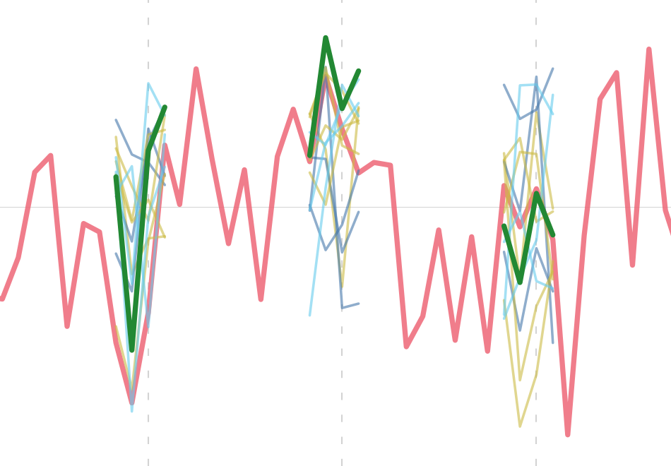 | <b>NAO RMSE</b>   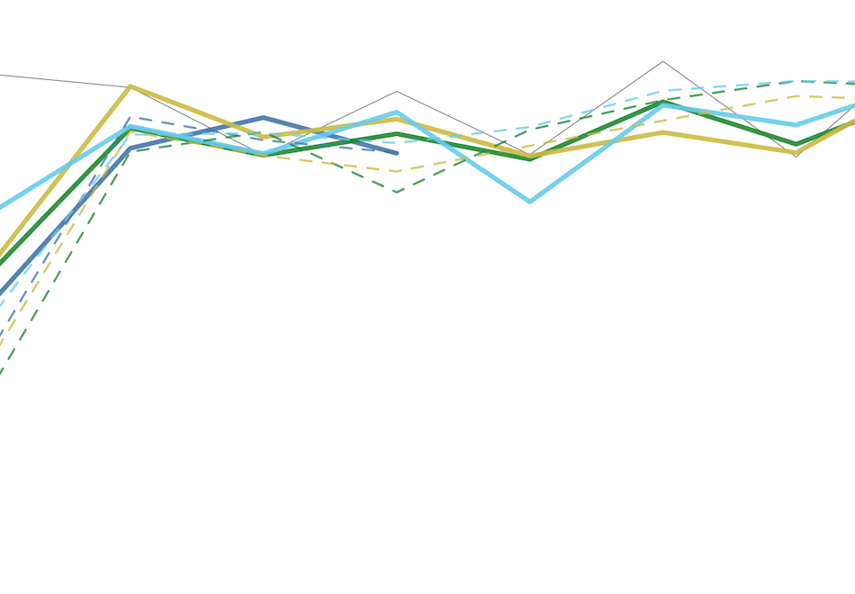 |
| :--- | :--- |
| 

Choose experiment
  &emsp;&emsp;&nbsp;  &emsp;&ensp;&nbsp;    [ens_means](https://github.com/ufs-community/ufs-analysis/blob/main/notebooks/sfs/nao/default/nao-index-ens_means.ipynb) &emsp;&nbsp;&ensp; [ens_means](https://mybinder.org/v2/gh/ufs-community/ufs-analysis/main?urlpath=lab/tree/notebooks/sfs/nao/default/nao-index-ens_means.ipynb) &emsp;&ensp;&nbsp; [ens_means](https://colab.research.google.com/github/ufs-community/ufs-analysis/blob/main/notebooks/sfs/nao/colab/nao-index-ens_means.ipynb)   [baseline](https://github.com/ufs-community/ufs-analysis/blob/main/notebooks/sfs/nao/default/nao-index-baseline.ipynb) &emsp;&emsp;&emsp;&nbsp; [baseline](https://mybinder.org/v2/gh/ufs-community/ufs-analysis/main?urlpath=lab/tree/notebooks/sfs/nao/default/nao-index-baseline.ipynb) &emsp;&emsp;&emsp;&nbsp; [baseline](https://colab.research.google.com/github/ufs-community/ufs-analysis/blob/main/notebooks/sfs/nao/colab/nao-index-baseline.ipynb)   [beta.0.1](https://github.com/ufs-community/ufs-analysis/blob/main/notebooks/sfs/nao/default/nao-index-beta.0.1.ipynb) &emsp;&emsp;&emsp;&ensp; [beta.0.1](https://mybinder.org/v2/gh/ufs-community/ufs-analysis/main?urlpath=lab/tree/notebooks/sfs/nao/default/nao-index-beta.0.1.ipynb) &emsp;&emsp;&emsp;&ensp; [beta.0.1](https://colab.research.google.com/github/ufs-community/ufs-analysis/blob/main/notebooks/sfs/nao/colab/nao-index-beta.0.1.ipynb)   [c96_beta.0.1](https://github.com/ufs-community/ufs-analysis/blob/main/notebooks/sfs/nao/default/nao-index-c96_beta.0.1.ipynb) &nbsp;&nbsp;&nbsp;&nbsp; [c96_beta.0.1](https://mybinder.org/v2/gh/ufs-community/ufs-analysis/main?urlpath=lab/tree/notebooks/sfs/nao/default/nao-index-c96_beta.0.1.ipynb) &ensp;&ensp;&nbsp; [c96_beta.0.1](https://colab.research.google.com/github/ufs-community/ufs-analysis/blob/main/notebooks/sfs/nao/colab/nao-index-c96_beta.0.1.ipynb)   [cpc_ics](https://github.com/ufs-community/ufs-analysis/blob/main/notebooks/sfs/nao/default/nao-index-cpc_ics.ipynb) &emsp;&emsp;&emsp;&ensp; [cpc_ics](https://mybinder.org/v2/gh/ufs-community/ufs-analysis/main?urlpath=lab/tree/notebooks/sfs/nao/default/nao-index-cpc_ics.ipynb) &emsp;&emsp;&emsp;&ensp; [cpc_ics](https://colab.research.google.com/github/ufs-community/ufs-analysis/blob/main/notebooks/sfs/nao/colab/nao-index-cpc_ics.ipynb) 
   | 

Choose platform
  &emsp;&emsp;&nbsp;  &emsp;&ensp;&nbsp;  
   |
| <b>NAO ACC Heatmap beta1</b>   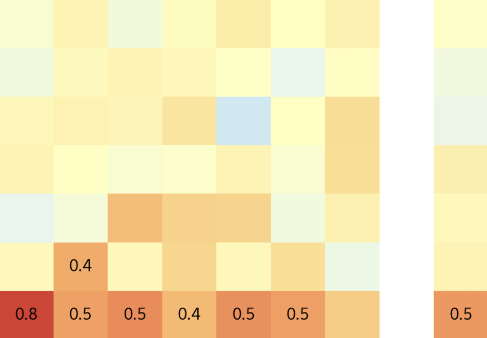 | <b>NAO Teleconnections T2m beta1</b>   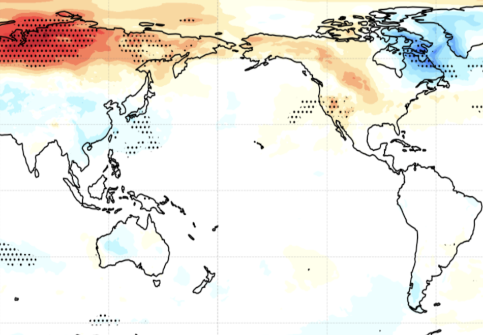  |
| 

Choose platform
  &emsp;&emsp;&nbsp;  &emsp;&ensp;&nbsp;  
   | 

Choose platform
  &emsp;&emsp;&nbsp;  
    |

  
PNA Analysis

| <b>PNA Index</b>   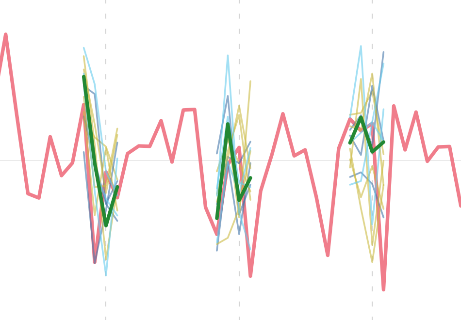 | <b>PNA RMSE</b>   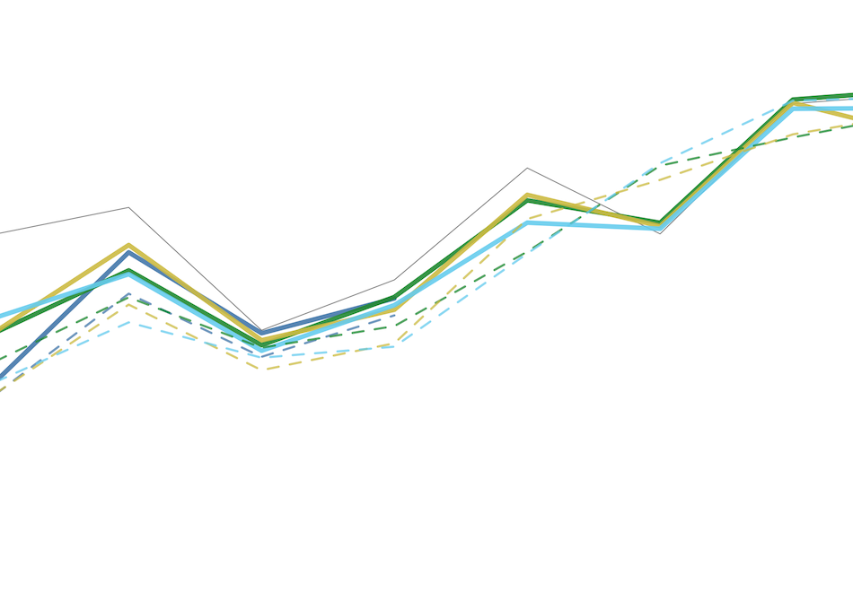 |
| :--- | :--- |
| 

Choose experiment
  &emsp;&emsp;&nbsp;  &emsp;&ensp;&nbsp;    [ens_means](https://github.com/ufs-community/ufs-analysis/blob/main/notebooks/sfs/pna/default/pna-index-ens_means.ipynb) &emsp;&nbsp;&ensp; [ens_means](https://colab.research.google.com/github/ufs-community/ufs-analysis/blob/main/notebooks/sfs/pna/colab/pna-index-ens_means.ipynb)   [baseline](https://github.com/ufs-community/ufs-analysis/blob/main/notebooks/sfs/pna/default/pna-index-baseline.ipynb) &emsp;&emsp;&emsp;&nbsp; [baseline](https://colab.research.google.com/github/ufs-community/ufs-analysis/blob/main/notebooks/sfs/pna/colab/pna-index-baseline.ipynb)   [beta.0.1](https://github.com/ufs-community/ufs-analysis/blob/main/notebooks/sfs/pna/default/pna-index-beta.0.1.ipynb) &emsp;&emsp;&emsp;&ensp; [beta.0.1](https://colab.research.google.com/github/ufs-community/ufs-analysis/blob/main/notebooks/sfs/pna/colab/pna-index-beta.0.1.ipynb)   [c96_beta.0.1](https://github.com/ufs-community/ufs-analysis/blob/main/notebooks/sfs/pna/default/pna-index-c96_beta.0.1.ipynb) &nbsp;&nbsp;&nbsp;&nbsp; [c96_beta.0.1](https://colab.research.google.com/github/ufs-community/ufs-analysis/blob/main/notebooks/sfs/pna/colab/pna-index-c96_beta.0.1.ipynb)   [cpc_ics](https://github.com/ufs-community/ufs-analysis/blob/main/notebooks/sfs/pna/default/pna-index-cpc_ics.ipynb) &emsp;&emsp;&emsp;&ensp; [cpc_ics](https://colab.research.google.com/github/ufs-community/ufs-analysis/blob/main/notebooks/sfs/pna/colab/pna-index-cpc_ics.ipynb) 
   | 

Choose platform
  &emsp;&emsp;&nbsp;  
   |
| <b>PNA ACC Heatmap beta1</b>   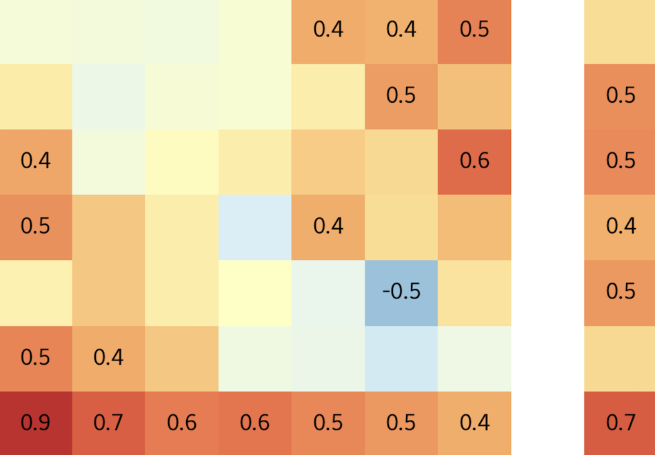 | <b>PNA Teleconnections T2m beta1</b>   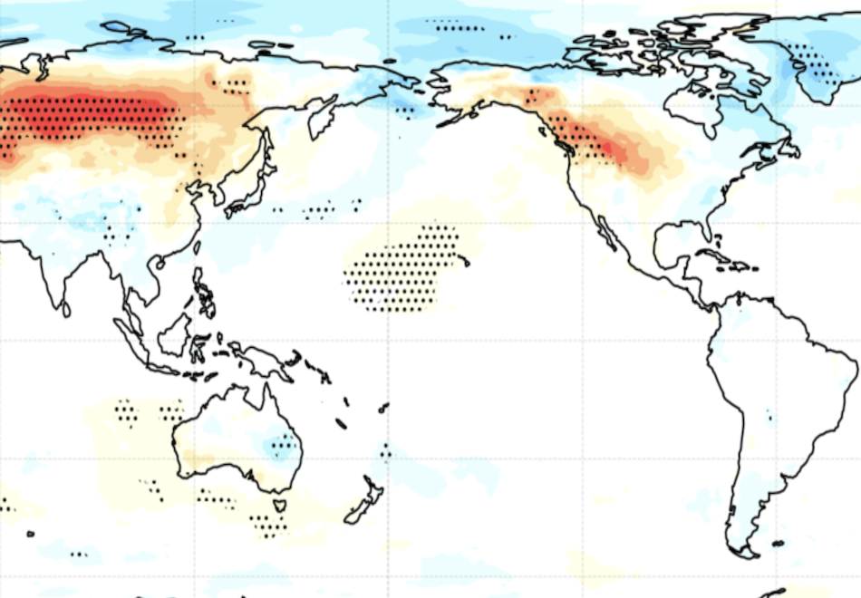  |
| 

Choose platform
  &emsp;&emsp;&nbsp;  
   | 

Choose platform
  &emsp;&emsp;&nbsp;  
    |

